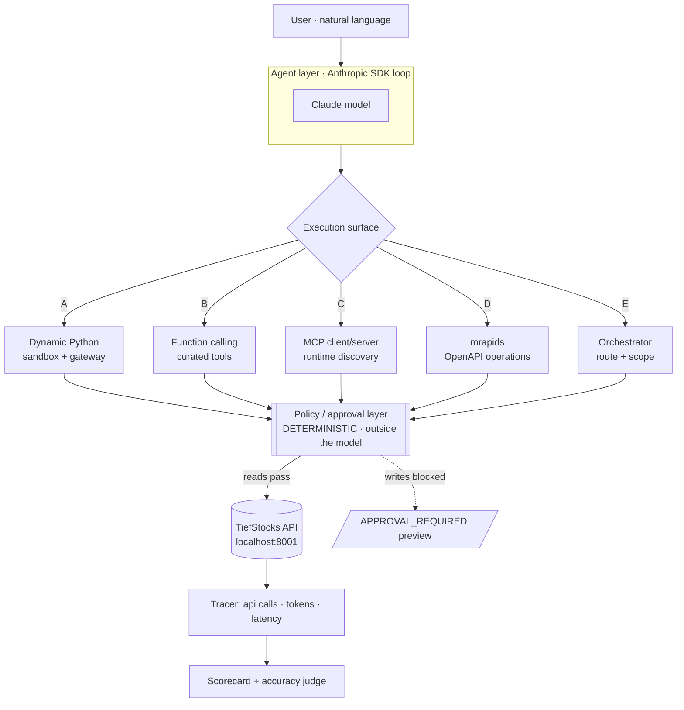

# Architecture — TiefBench

Each option is a different **execution surface**: the same agent goal (natural
language → intent → correct, safe, affordable API calls) reached a different way.
They share one agent layer, one deterministic policy layer, and one API.

## Shared layered architecture

Two invariants hold for **every** option:

1. **Frameworks reason; they do not govern.** Writes are intercepted by the
   policy layer (`tools.py` / `mcp_server.py` / `sandbox_shim.py`), never by the
   model's goodwill. Result: `APPROVAL_REQUIRED`, recorded as `BLOCKED`.
2. **Everything is measured the same way.** A shared `Tracer` (`core.py`) counts
   API calls, tokens, and latency so the scorecard is apples-to-apples.

## The options

| Doc | Option | One-liner |
| --- | ------ | --------- |
| [option-a-dynamic-python.md](./option-a-dynamic-python.md) | A | LLM writes Python, run in a sandbox via a gateway shim |
| [option-b-function-calling.md](./option-b-function-calling.md) | B | Curated tools + Anthropic tool-use loop (baseline) |
| [option-c-mcp.md](./option-c-mcp.md) | C | MCP server over stdio; client discovers tools at runtime |
| [option-d-mrapids.md](./option-d-mrapids.md) | D | Agent plans OpenAPI operations; mrapids executes them |
| [option-e-orchestrator.md](./option-e-orchestrator.md) | E | Planner routes intent to a least-privilege tool scope |

## How to read each doc

Every option doc has the same sections: **What it is → Diagram (sequence) →
Components (files) → Request flow → Governance → Cost/accuracy profile →
Strengths & weaknesses**.

> Diagrams use [Mermaid](https://mermaid.js.org/) — they render on GitHub and in
> most Markdown viewers. An ASCII fallback is included where useful.
