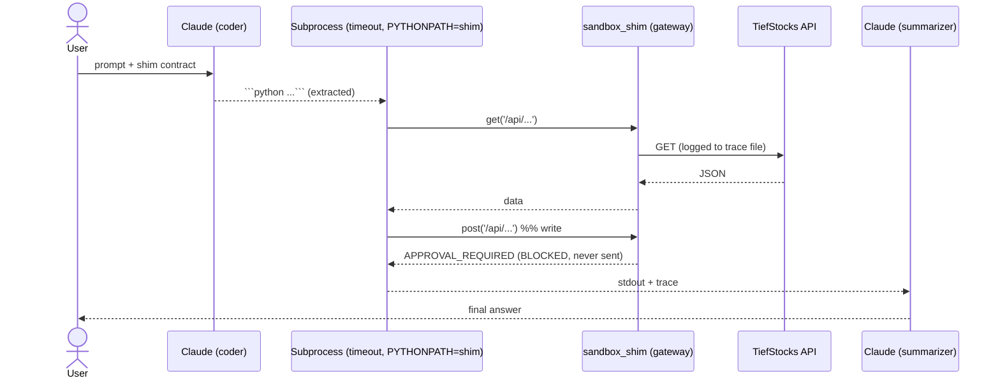

# Option A — Dynamic Python (benchmark)

## What it is

The "max flexibility / max risk" extreme. The LLM **writes a Python script**;
the harness runs it in a constrained subprocess whose only network access is a
**gateway shim** that counts calls and blocks writes. A second LLM call
summarizes the script's output into the final answer.

## Diagram



ASCII view of the trust boundary:

```
Claude code ──> [ subprocess: no PATH net, only `from sandbox_shim import get,post` ]
                              │
                              ▼
                   sandbox_shim  = the API gateway
                   • logs every call   • get→API   • post→BLOCKED
```

## Components

| File | Role |
| ---- | ---- |
| `options/option_a_dynamic.py` | codegen → subprocess run → summarize |
| `options/sandbox_shim.py` | the gateway injected into the sandbox |
| `core.py` | LLM wrapper + `Tracer` |

## Request flow

1. Ask Claude for a script that uses only `get()`/`post()` from the shim.
2. Extract the fenced code, write it to a temp dir.
3. Run with `subprocess` (40s timeout, `PYTHONPATH` = shim dir, no inherited
   secrets) — generated code can't reach the network except through the shim.
4. The shim logs calls to a trace file; `post()` returns `APPROVAL_REQUIRED`.
5. Replay the trace into the `Tracer`; summarize stdout with a second LLM call.

## Governance

Enforced at the **gateway**, not the model: `sandbox_shim.post()` never sends.
Even if the generated code is malicious or wrong, writes can't execute and the
network surface is one module wide.

## Cost / accuracy profile (observed)

- **Accuracy:** good for reads, but variance is higher — the model can write
  buggy code or call the wrong path.
- **Cost:** two LLM calls (codegen + summarize) → moderate.
- **Risk:** highest. Sandbox + gateway are mandatory, not optional.

## Strengths & weaknesses

| 👍 | 👎 |
| -- | -- |
| Maximum flexibility (any logic) | Hardest to make safe — needs real sandboxing |
| No predefined tool surface | Higher variance, harder to audit |
| Good as a capability ceiling | Two LLM calls; codegen failure modes |

> Used as a **benchmark** to bound the extreme — not recommended as the
> production surface for write paths.
