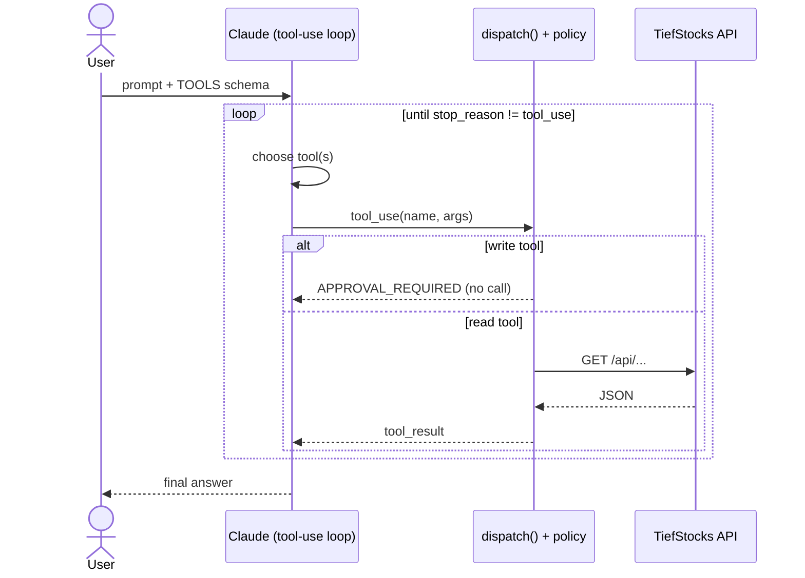

# Option B — Direct Function Calling

## What it is

The baseline. A small set of **curated tools** is handed to Claude; the model
picks tools, the harness executes them against the API, results go back, repeat
until the model answers. The policy layer gates writes.

## Diagram

## Components

| File | Role |
| ---- | ---- |
| `options/option_b_funcs.py` | the tool-use loop |
| `tools.py` | `TOOLS` schemas, `dispatch()`, `WRITE_TOOLS` policy gate |
| `api/tiefstocks.py` | instrumented HTTP client (counts calls) |
| `core.py` | LLM wrapper + `Tracer` (tokens/latency) |

## Request flow

1. Send prompt + `TOOLS` (8 curated tools) to Claude.
2. If `stop_reason == "tool_use"`, run each tool via `dispatch()`.
3. `dispatch()` blocks `add_transaction`/`record_decision` → `APPROVAL_REQUIRED`;
   reads hit the API and are traced.
4. Append `tool_result`, loop (max 8 turns).
5. Return the model's text.

## Governance

The gate is `WRITE_TOOLS` in `tools.py`. The model can *attempt* a write; the
dispatcher never executes it and returns a preview. Recorded as
`BLOCKED POST /api/portfolio/transactions`.

## Cost / accuracy profile (observed)

- **Accuracy:** high on a stable, well-described tool set; judge 95–100 on reads.
- **Cost:** low — only the tools you ship enter context (~4–5k input tokens).
- **Latency:** ~6–15s for 1–3 tool turns.
- **Scales poorly** as tools multiply (every schema is always in context) — this
  is where it loses to C/D/E at cross-domain (L4).

## Strengths & weaknesses

| 👍 | 👎 |
| -- | -- |
| Simplest, most predictable | Tool surface is static & always in-context |
| Small, auditable capability set | Sprawl hurts cost + selection at scale |
| Best baseline for stable APIs | No runtime discovery / multi-client reuse |
