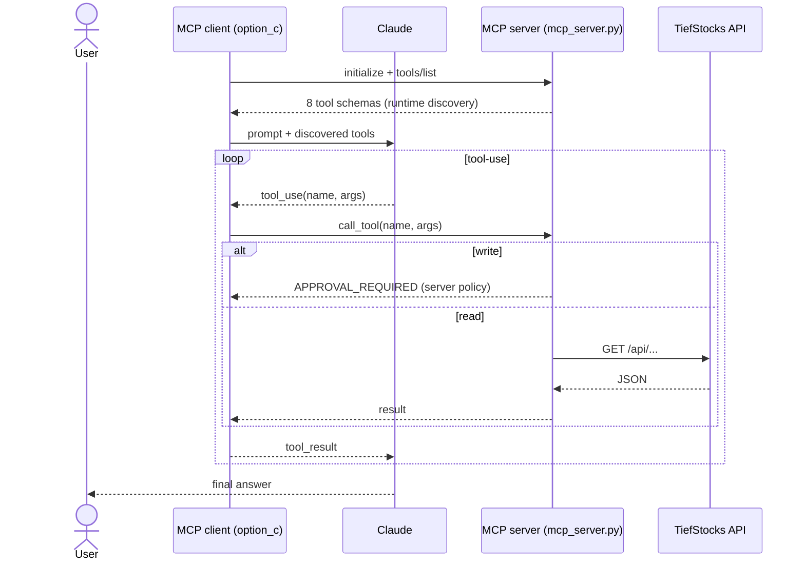

# Option C — MCP Server

## What it is

The same capabilities exposed by a **real MCP server** (FastMCP, over stdio). The
client **discovers tools at runtime** (`tools/list`), maps them into Anthropic
tool format, and drives the tool-use loop — dispatching every call back through
the MCP session. Governance lives **server-side**.

## Diagram

## Components

| File | Role |
| ---- | ---- |
| `mcp_server.py` | FastMCP server; tools + **server-side** write gate |
| `options/option_c_mcp.py` | stdio client, discovery, tool-use loop, trace mapping |
| `api/tiefstocks.py` | HTTP client used inside the server |

## Request flow

1. Client launches the server as a subprocess over **stdio**.
2. `initialize()` then `list_tools()` → tools discovered at runtime (not hardcoded
   in the client).
3. Convert MCP schemas → Anthropic tools; run the loop.
4. Each `tool_use` → `session.call_tool()`; the server runs reads and gates writes.
5. The client reconstructs the API trace from tool calls for scorecard parity.

## Governance

Enforced **on the server** (`add_transaction` returns `APPROVAL_REQUIRED`). A
different client (Claude Desktop, another agent) hitting the same server gets the
same policy — governance travels with the server, not the caller.

## Cost / accuracy profile (observed)

- **Accuracy:** on par with B for the same capabilities.
- **Cost:** slightly higher input tokens (discovered schemas enter context); use
  tool-search/filtering when many domains exist to keep this down.
- **Operational cost:** a server to run, version, and secure.

## Strengths & weaknesses

| 👍 | 👎 |
| -- | -- |
| Runtime discovery; multi-client reuse | Extra moving part (server + transport) |
| Policy + role/tenant filtering server-side | Schema tokens can balloon with scale |
| Standard protocol, ecosystem | Discovery only pays off across many tools/domains |
