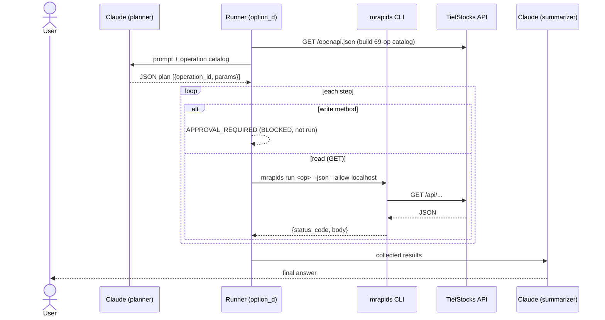

# Option D — mrapids / OpenAPI Operations

## What it is

The agent never hand-writes HTTP. It **plans which OpenAPI operations to run**
(picked from the live spec catalog), and the [`mrapids`](https://microrapid.io/mrapids/)
CLI executes them **deterministically** with structured JSON output. Writes are
gated by policy. A final LLM call summarizes the structured results.

## Diagram

## Components

| File | Role |
| ---- | ---- |
| `options/option_d_mrapids.py` | catalog build, planner, mrapids exec, summarize |
| `../tiefstocks/specs/tiefstocks.json` | the OpenAPI spec mrapids runs against |
| `mrapids` (v0.1.30) | deterministic executor with `--json` + exit codes |

## Request flow

1. Build an operation **catalog** from `/openapi.json` (id, method, path, params).
2. Planner LLM returns a minimal JSON plan of operations to run.
3. For each step: GET → `mrapids run`; write method → gated (`APPROVAL_REQUIRED`).
4. Summarizer LLM turns the structured results into the answer.

## Governance

The gate is **method-based** (`POST/PUT/PATCH/DELETE` never run). mrapids adds its
own controls: allowlists, `--dry-run`, `history`/`compare` audit, exit codes
(0/3/4/5/7). The agent chooses a *workflow*, not raw endpoints.

## Cost / accuracy profile (observed)

- **Accuracy:** strong on sequencing — execution is deterministic once planned.
- **Cost:** two LLM calls (plan + summarize); catalog can be trimmed to relevant
  ops to cut planner tokens.
- **Auditability:** highest — every call is a logged CLI invocation with JSON.

## Known limitation

`mrapids collection run` has **no `--allow-localhost`** flag in v0.1.30, so
multi-step *collections* can't target a loopback host (single `run` can). This
runner therefore drives single `run` calls per step against `127.0.0.1`.
Irrelevant for real enterprise hostnames.

## Strengths & weaknesses

| 👍 | 👎 |
| -- | -- |
| Deterministic, auditable execution | Needs the CLI + spec maintained |
| Agent picks workflows, not endpoints | Two LLM calls (plan + summarize) |
| Built-in dry-run/history/exit-codes | Collection localhost limitation (v0.1.30) |
