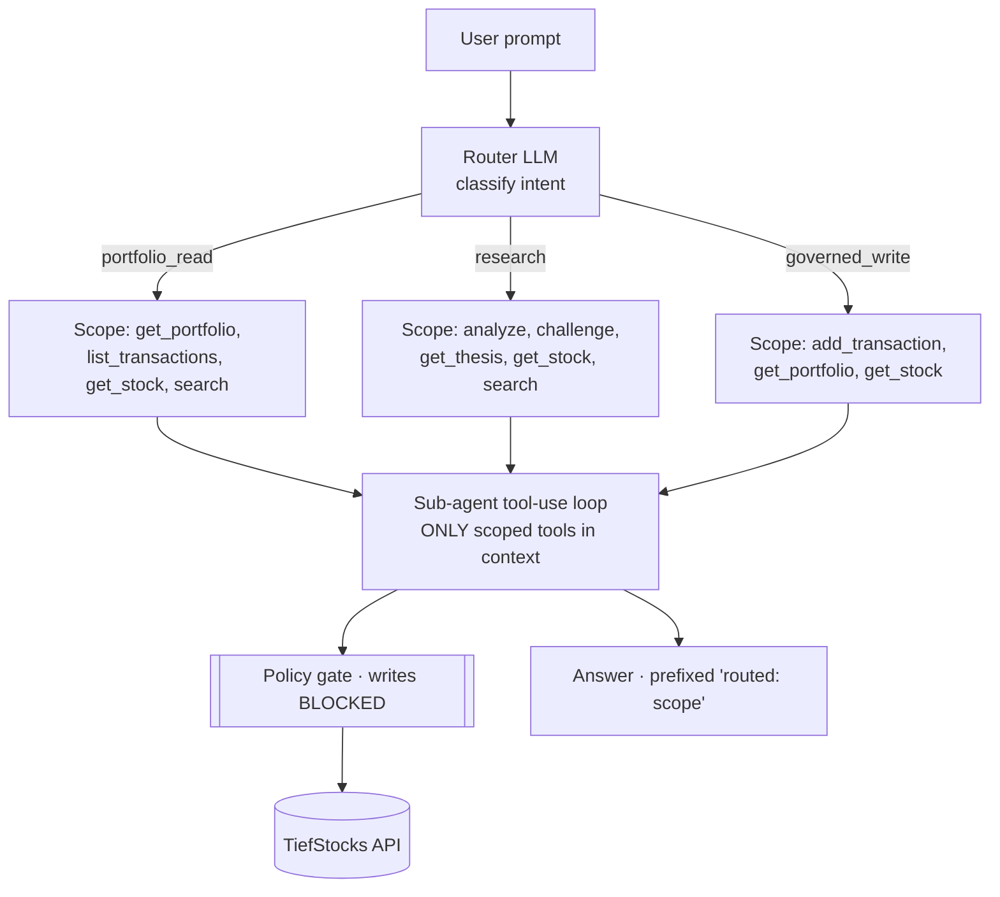

# Option E — Vendor-style Orchestrator

## What it is

A **planner** first classifies intent and picks a **least-privilege tool scope**;
a domain sub-agent then executes with *only that scope visible*. The user never
sees the tool surface. Built on the same tools + policy layer as Option B.

## Diagram

## Components

| File | Role |
| ---- | ---- |
| `options/option_e_orchestrator.py` | router + `SCOPES` + scoped sub-agent loop |
| `tools.py` | shared tool schemas + policy gate |
| `core.py` | LLM wrapper + `Tracer` |

## Request flow

1. **Router** LLM maps the prompt to one of `portfolio_read` / `research` /
   `governed_write`.
2. The matching `SCOPES[...]` list defines the **only** tools the sub-agent sees
   (least privilege — e.g. a read request never has `add_transaction` in context).
3. Sub-agent runs the tool-use loop within that scope; writes still hit the policy
   gate.
4. Answer is returned, prefixed with the routed scope for transparency.

## Governance

Two layers: **scope confinement** (high-risk tools aren't even visible unless the
router selects `governed_write`) **plus** the deterministic policy gate. The
external user sees an outcome, not the tools.

## Cost / accuracy profile (observed)

- **Accuracy:** good; routing reduces wrong-tool selection at scale.
- **Cost:** one extra (cheap, ~20-token) router call per request.
- **Control:** highest — closest to a vendor "give me an outcome" agent.

## Strengths & weaknesses

| 👍 | 👎 |
| -- | -- |
| Least-privilege by construction | Extra router hop + a routing failure mode |
| Scales to many domains via routing | More machinery than a flat tool set |
| Hides internals; outcome-oriented | Router mis-route → wrong scope |
